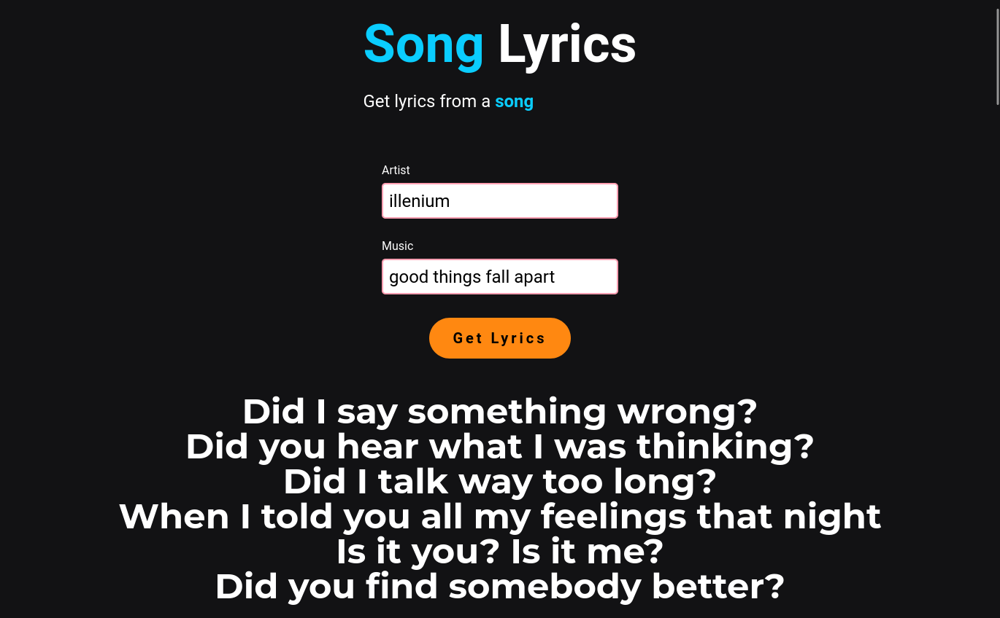

# [Song Lyrics](https://song-lyrics-gamma.vercel.app/)

    
    
    
    
    

  

> React aplication to get the lyrics from a specific song

Consuming the [lyrics.ovh api](https://lyricsovh.docs.apiary.io) to get the lyrics

## 🚀 How to use the project

### 🛹 Clone the repo

`git clone https://github.com/andreseichi/song-lyrics.git`

or

`git@github.com:andreseichi/song-lyrics.git`

### 📒 Access the repo

`cd song-lyrics`

### 🧭 Install all dependencies with yarn

`yarn`

### 🔨 Build it

`yarn build`

## [Demo]('https://song-lyrics-gamma.vercel.app/')
